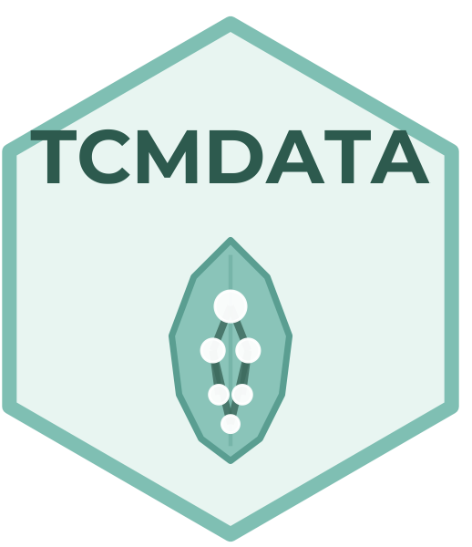
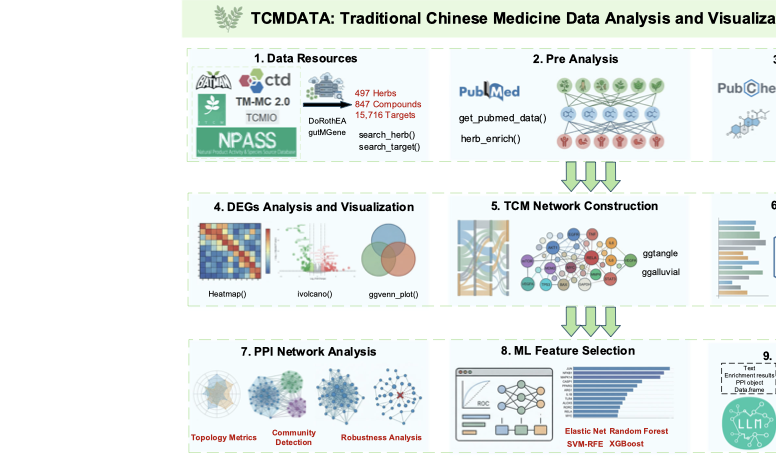

# TCMDATA: Traditional Chinese Medicine Data Analysis and Visualization R Package



[](https://github.com/Hinna0818/TCMDATA)
[](https://github.com/Hinna0818/TCMDATA/actions/workflows/bookdown.yaml)
[](https://cran.r-project.org/)
[](https://github.com/Hinna0818/TCMDATA)
[](https://hinna0818.github.io/TCMDATA/)

- **TCMDATA** is a comprehensive R toolkit for **Traditional Chinese Medicine (TCM) network pharmacology** research.
- It provides an end-to-end computational workflow—from herb–compound–target data retrieval and pharmacological network construction, through enrichment analysis and PPI mining, to machine-learning-based biomarker screening and AI-powered result interpretation.
- Publication-ready visualizations including Sankey diagrams, docking heatmaps, lollipop plots, and more.

For details, please visit the [full documentation](https://hinna0818.github.io/TCMDATA/).

---



## Highlights

- 🌿 **Built-in TCM Database**: Manually curated herb–compound–target interaction data ready for analysis
- 🔬 **PubChem Integration**: Compound identification, property retrieval, and structure download
- 📊 **PPI Network Analysis**: 17+ centrality metrics with community detection and robustness evaluation
- 🤖 **Machine Learning-based Feature Selection**: 6 algorithms (LASSO, Elastic Net, Ridge, RF+Boruta, SVM-RFE, XGBoost) with consensus scoring
- 💡 **AI-LLM Interpretation**: LLM-powered automated result summarization
- 📚 **Literature Mining**: PubMed search for TCM–disease association studies
- 🔗 **Seamless Integration**: Works with clusterProfiler, enrichplot, and other Bioconductor tools for enrichment analysis

## Feature Overview

| Module | Description | Key Functions |
|--------|-------------|---------------|
| **Data Retrieval** | Bidirectional query of herbs, compounds, and validated targets | `search_herb()`, `search_target()` |
| **Molecule Detection** | PubChem-based CID resolution, property annotation, similarity search | `resolve_cid()`, `getprops()`, `compound_similarity()` |
| **Network Construction** | Build herb–compound–target networks with topological metrics | `prepare_herb_graph()` |
| **Enrichment Analysis** | Herb-based over-representation analysis; GO/KEGG compatible | `herb_enricher()` |
| **PPI Analysis** | 15+ centrality metrics, community detection, robustness evaluation | `ppi_subset()`, `compute_nodeinfo()`, `ppi_knock()` |
| **Clustering** | Louvain, MCL, and MCODE community detection | `run_louvain()`, `run_MCL()`, `run_mcode()` |
| **ML Screening** | 6 algorithms × 3 validation modes with consensus analysis | `run_ml_screening()`, `plot_ml_roc()` |
| **AI Interpretation** | LLM-powered interpretation for enrichment, PPI, tables | `tcm_interpret()`, `draft_result_paragraph()` |
| **Visualization** | Sankey, docking heatmaps, lollipop plots, radar charts | `tcm_sankey()`, `ggdock()`, `gglollipop()` |

## Installation

```r
# install.packages("devtools")
options(timeout = 600)
devtools::install_github("Hinna0818/TCMDATA")
```

## Quick Start

```r
library(TCMDATA)

# Search by herb name (supports Chinese pinyin)
huangqi <- search_herb("huangqi", "Herb_pinyin_name")
head(huangqi)

# Reverse lookup: find herbs targeting a specific gene
il6_herbs <- search_target("IL6")
head(il6_herbs)
```

## AI-Powered Interpretation

TCMDATA integrates an AI module via [aisdk](https://github.com/YuLab-SMU/aisdk) for intelligent result interpretation.

```r
# One-time setup
devtools::install_github("YuLab-SMU/aisdk")

tcm_setup(
  provider = "openai",
  api_key  = "sk-xxxx",
  model    = "gpt-4o",
  save     = TRUE
)

# Interpret enrichment results
ai_res <- tcm_interpret(enrich_res, language = "en")

# Generate manuscript-ready paragraph
draft <- draft_result_paragraph(ai_res, language = "en")
```

## Documentation

Complete tutorials with worked examples can be found [here](<https://hinna0818.github.io/TCMDATA/>).

## Citation

If you use TCMDATA in your research, please cite:

```
DOI pending
```
