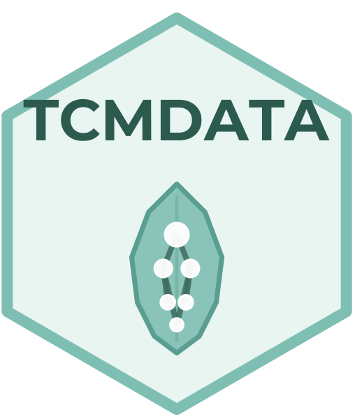
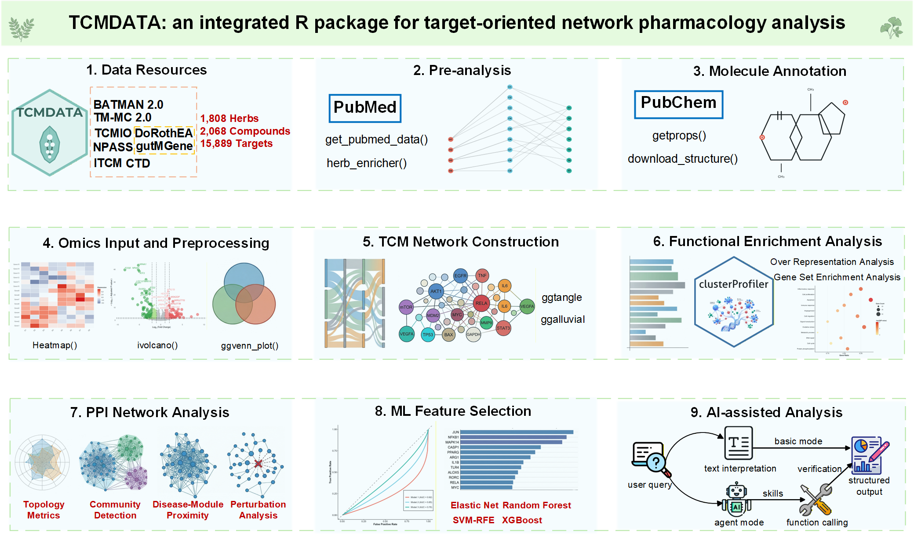

# TCMDATA: an integrated R package for target-oriented network pharmacology analysis and AI-assisted interpretation in traditional Chinese medicine



[](https://github.com/Hinna0818/TCMDATA)
[](https://github.com/Hinna0818/TCMDATA/actions/workflows/bookdown.yaml)
[](https://cran.r-project.org/)
[](https://github.com/Hinna0818/TCMDATA)
[](https://hinna0818.github.io/TCMDATA/)

- **TCMDATA** is a comprehensive R toolkit for **Traditional Chinese Medicine (TCM) network pharmacology** research.
- It provides an end-to-end computational workflow—from herb–compound–target data retrieval and pharmacological network construction, through enrichment analysis and PPI mining, to machine-learning-based biomarker screening and AI-powered result interpretation.
- Publication-ready visualizations including Sankey diagrams, docking heatmaps, lollipop plots, and more.

For details, please visit the [full documentation](https://hinna0818.github.io/TCMDATA/).

---



## Highlights

- 🌿 **Built-in TCM Database**: Manually curated herb–compound–target interaction data ready for analysis
- 🔬 **PubChem Integration**: Compound identification, property retrieval, and structure download
- 📊 **PPI Network Analysis**: STRING-based network retrieval, 17+ centrality metrics, community detection, robustness evaluation, and weighted disease-module proximity analysis for target or formula prioritization
- 🤖 **Machine Learning-based Feature Selection**: 6 algorithms (LASSO, Elastic Net, Ridge, RF+Boruta, SVM-RFE, XGBoost) with consensus scoring
- 🧠 **AI Agent System**: LLM-powered agent with natural language task routing, skill-based workflow, and interactive chat (`tcm_agent()`, `tcm_chat()`)
- 📚 **Literature & Data Mining**: PubMed search and GEO dataset discovery for TCM–disease studies
- 🔗 **Seamless Integration**: Works with clusterProfiler, enrichplot, and other Bioconductor tools for enrichment analysis

## Feature Overview

| Module | Description | Key Functions |
|--------|-------------|---------------|
| **Data Retrieval** | Bidirectional query of herbs, compounds, and validated targets | `search_herb()`, `search_target()` |
| **Disease Targets** | Open Targets disease–target queries and GEO dataset discovery | `query_disease_targets()`, `search_disease_efo()`, `search_geo_datasets()` |
| **Molecule Detection** | PubChem-based CID resolution, property annotation, similarity search | `resolve_cid()`, `getprops()`, `compound_similarity()` |
| **Network Construction** | Build herb–compound–target networks with topological metrics | `prepare_herb_graph()` |
| **Enrichment Analysis** | Herb-based over-representation analysis; GO/KEGG compatible | `herb_enricher()` |
| **PPI Analysis** | STRING retrieval, 17+ centrality metrics, community detection, robustness, and weighted target-set proximity to disease modules | `get_ppi()`, `compute_nodeinfo()`, `rank_tcm_targets_by_ppi()`, `evaluate_tcm_target_sets_by_ppi()`, `ppi_knock()` |
| **Clustering** | Louvain, MCL, and MCODE community detection | `run_louvain()`, `run_MCL()`, `run_mcode()` |
| **ML Screening** | 6 algorithms × 3 validation modes with consensus analysis | `run_ml_screening()`, `plot_ml_roc()` |
| **AI Agent** | Natural language task routing, skill-based workflow, interactive chat | `tcm_agent()`, `tcm_chat()`, `tcm_interpret()` |
| **AI Interpretation** | LLM-powered interpretation for enrichment, PPI, tables | `tcm_interpret()`, `draft_result_paragraph()` |
| **Visualization** | Sankey, docking heatmaps, lollipop, UpSet, radar charts | `tcm_sankey()`, `ggdock()`, `gglollipop()`, `upsetplot()` |

## Installation

```r
# install.packages("devtools")
options(timeout = 600)
devtools::install_github("Hinna0818/TCMDATA")
```

## Quick Start

```r
library(TCMDATA)

# Search by herb name (supports Chinese pinyin)
huangqi <- search_herb("huangqi", "Herb_pinyin_name")
head(huangqi)

# Reverse lookup: find herbs targeting a specific gene
il6_herbs <- search_target("IL6")
head(il6_herbs)
```

## AI Agent System

TCMDATA integrates an AI agent layer via [aisdk](https://github.com/YuLab-SMU/aisdk), featuring natural language task routing, a skill-based workflow engine, and 36 registered tools.

```r
# One-time setup
remotes::install_github("YuLab-SMU/aisdk")

# Also required when using DeepSeek or another additional provider
remotes::install_github("YuLab-SMU/aisdk.providers")

tcm_setup(
  provider = "openai",
  api_key  = "sk-xxxx",
  model    = "gpt-5.6-sol",
  save     = TRUE
)

# DeepSeek uses the companion provider package
tcm_setup("deepseek", "sk-xxxx", "deepseek-chat")

# OpenAI-compatible relay endpoint
tcm_setup(
  provider = "anthropic",
  api_key = "relay-key",
  model = "relay-claude-model-id",
  base_url = "https://relay.example.com/v1",
  api_format = "chat_completions"
)

# One-shot agent: auto-routes task to appropriate tools
result <- tcm_agent("Query the targets of Astragalus and list the top 10 most frequently occurring ones.")

# Interactive multi-turn chat session
tcm_chat()

# AI-powered result interpretation
ai_res <- tcm_interpret(enrich_res, language = "en")
draft  <- draft_result_paragraph(ai_res, language = "en")
```

The agent supports 11 task types including herb/disease/target lookup, enrichment, PPI analysis, ML screening, PubMed search, GEO dataset discovery, and more. Plot requests create artifacts that are automatically exported to `.GlobalEnv`. Each tool-using chat turn also exports a replayable script such as `tcm_script_001` for inspection and reuse. Skills can be customized via `tcm_init_skills()`.

## Documentation

Complete tutorials with worked examples can be found [here](<https://hinna0818.github.io/TCMDATA/>).

## Citation

If you use TCMDATA in your research, please cite:

```
DOI pending
```
