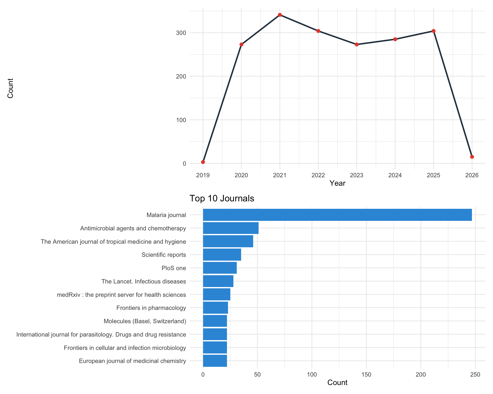

# Pre-analysis {#pre-analysis}

Prior to constructing pharmacological networks, a preliminary literature survey and target-level screening are often necessary to define the research scope. `TCMDATA` offers two utilities for this purpose: `get_pubmed_data()` for mining PubMed literature, and `herb_enricher()` for identifying candidate herbs through over-representation analysis.

---

## PubMed literature mining

`get_pubmed_data()` queries the NCBI PubMed database via E-utilities and retrieves publications matching a given TCM–disease keyword pair within a specified time frame. The function returns an S3 object of class `tcm_pubmed`, containing the literature records, annual publication counts, and the query string.

A valid email address is required by NCBI for API access.

```{r, eval=FALSE}
library(TCMDATA)

result <- get_pubmed_data(
  tcm_name     = "Artemisinin",
  disease_name = "Malaria",
  year_range   = c(2020, 2025),
  retmax       = 2000,
  email        = "your_email@example.com"
)
```

If `year_range` is not specified, the function defaults to the most recent 10 years. The `retmax` argument controls the maximum number of records retrieved; setting `retmax = "all"` fetches all matching records, which is recommended when accurate annual trend statistics are needed.

### Visualization

The `plot()` method provides two chart types. `type = "trend"` produces an annual publication count line chart, while `type = "journal"` shows a bar chart of the top *N* journals ranked by article count.

```{r pubmed-plots, eval=FALSE, fig.width=10, fig.height=8, fig.align='center', out.width='95%'}
library(aplot)
p_trend   <- plot(result, type = "trend")
p_journal <- plot(result, type = "journal", N = 10)

plot_list(p_trend, p_journal, ncol = 1)
```

```{r, echo=FALSE, out.width='95%', fig.align='center'}

```

### Exporting results

`get_pubmed_table()` extracts the literature records sorted by publication year in descending order. An optional `file` argument writes the table directly to a CSV file.

```{r, eval=FALSE}
lit_table <- get_pubmed_table(result, n = 20, file = "pubmed_results.csv")
head(lit_table)
```

---

## Herb enrichment analysis {#herb-ora}

A central question in TCM network pharmacology is which herbs possess targets that significantly overlap with a given disease gene set. `herb_enricher()` addresses this through Over-Representation Analysis (ORA), using the herb–target relationships curated in TCMDATA as the annotation background. Internally, it wraps `clusterProfiler::enricher()`.

The logic is analogous to conventional GO or KEGG enrichment: each herb defines a gene set composed of its known targets, and a Fisher's exact test evaluates whether the overlap between the query genes and each herb's targets exceeds what is expected by chance.

### Example: Diabetic Nephropathy

`TCMDATA` includes `dn_gcds`, a character vector of Diabetic Nephropathy (DN)-associated genes sourced from GeneCards. We use these as the query gene set to identify enriched herbs.

```{r, collapse=FALSE}
library(TCMDATA)
library(enrichplot)

data("dn_gcds")
head(dn_gcds)
```

Then, we can perform ORA analysis using `herb_enricher()`:
```{r, collapse=FALSE}
enrich_res <- herb_enricher(genes = dn_gcds, type = "Herb_pinyin_name")
head(enrich_res)
```

The returned `enrichResult` object is compatible with all `enrichplot` visualization functions. Below we show a dot plot highlighting the top 15 enriched herbs:

```{r herb-dotplot, fig.width=8, fig.height=6, fig.align='center', out.width='90%'}
dotplot(enrich_res, showCategory = 15)
```

```{r herb-barplot, fig.width=9, fig.height=7, fig.align='center', out.width='90%'}
barplot(enrich_res, showCategory = 15)
```

In the output, `GeneRatio` indicates the fraction of query genes present in each herb's target set, `p.adjust` gives the Benjamini–Hochberg corrected p-value, and `geneID` lists the overlapping gene symbols. Herbs with lower adjusted p-values and higher gene ratios are stronger candidates for subsequent network analysis.

---


## Session information

```{r, collapse=FALSE}
sessionInfo()
```
