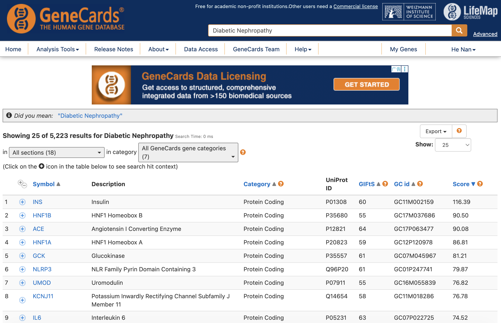
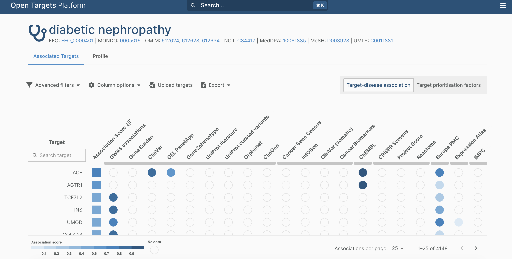
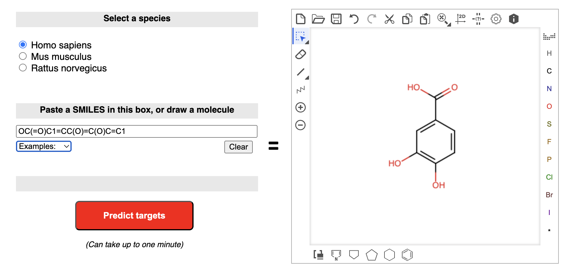
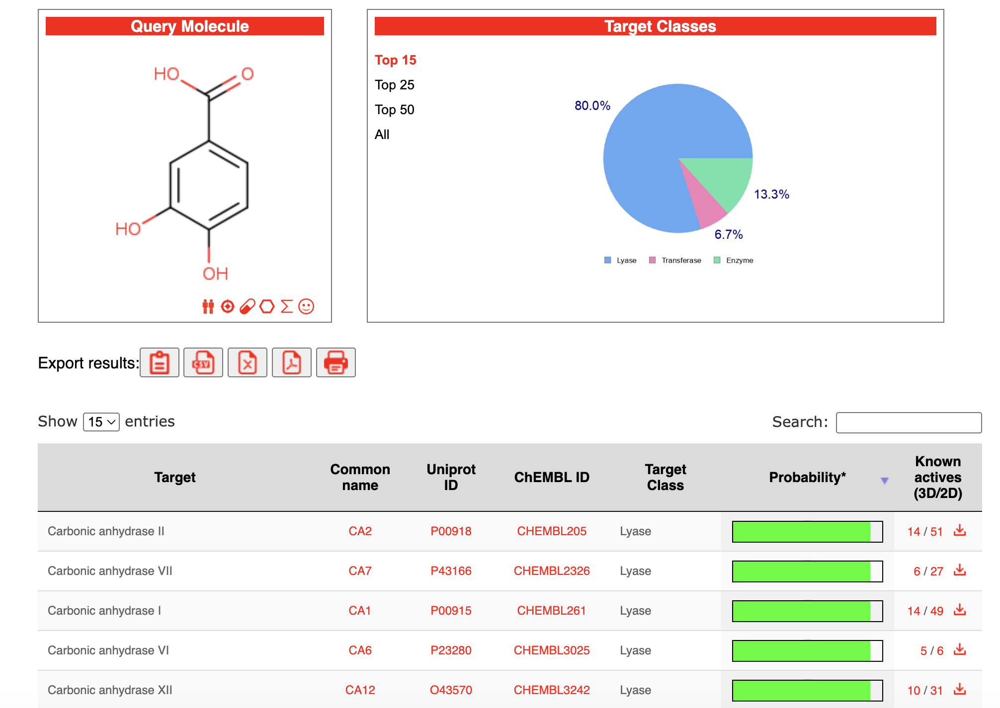
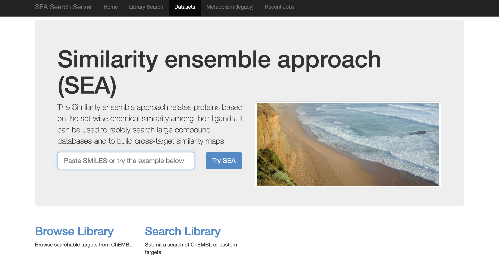
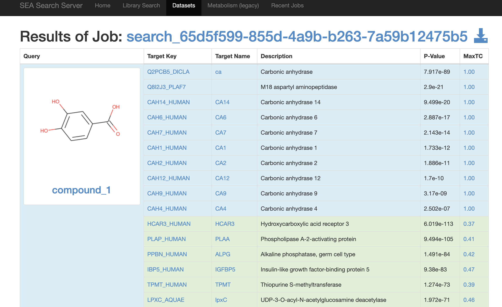

# Target retrieval and DEG analysis {#target-retrieval}

In network pharmacology analysis, disease target retrieval and differential gene screening are two essential preparatory steps. This chapter introduces common and free disease target databases and their retrieval strategies, demonstrates volcano plot visualization of `DESeq2` results, and performs intersection analysis between DEGs and disease targets using Venn and UpSet plots.

---

## Disease target databases {#disease-db}

Multiple public databases catalogue gene–disease associations with varying evidence levels. In practice, combining targets from multiple sources (often intersection) improves both coverage and reliability. Here, we introduce some **commonly used and user-friendly** databases for disease target retrieval in TCM network pharmacology research.

### GeneCards

[GeneCards](https://www.genecards.org/) is an integrative database that provides comprehensive information on human genes, including disease associations (Stelzer et al., 2016). Each gene–disease link is assigned a **Relevance Score** that summarizes evidence from multiple sources.

However, GeneCards does not offer a direct API for bulk retrieval, so the common workflow involves manual search and export.

For example, to retrieve targets for "Diabetic Nephropathy", we can manually search GeneCards, export the results as a CSV file, and filter by Relevance Score.



Then, we can read the exported CSV and filter genes based on the Relevance Score:
```{r genecards-demo, eval=FALSE, collapse=FALSE}
## uploaded "GeneCards-SearchResults.csv" from GeneCards export
dn_raw <- read.csv("GeneCards-SearchResults.csv")

## subset genes with Relevance Score > 10
dn_targets <- dn_raw$Gene.Symbol[dn_raw$Relevance.Score > 10]
head(dn_targets)
```

```
[1] "INS"   "HNF1B" "ACE"   "HNF1A" "GCK"   "NLRP3"
```

Notably, `TCMDATA` provides a built-in GeneCards-derived target list for Diabetic Nephropathy for case study demonstration:

```{r dn-gcds-show, collapse=FALSE}
library(TCMDATA)
data(dn_gcds)
head(dn_gcds, 20)
```


### Open Targets Platform

The [Open Targets Platform](https://platform.opentargets.org/) is a comprehensive and robust resource designed for therapeutic target identification and prioritization (Buniello et al., 2025). It systematically aggregates, validates, and scores evidence linking targets to diseases across heterogeneous data sources. By organizing its knowledge base around five core entities—Target, Disease/Phenotype, Variant, Study, and Drug—the platform provides a highly structured framework that facilitates hypothesis generation and evidence-based target selection in drug discovery.

User can retrieve disease targets by both API and web interface. The API allows programmatic access to the data, while the web interface provides an intuitive way to explore target–disease associations.

For web interface, "Diabetic Nephropathy" can be searched directly, and the resulting target list can be exported as json and tsv format for downstream analysis:



```{r opentarget-demo, eval=FALSE, collapse=FALSE}
ot <- read.delim("OT-EFO_0000401-associated-targets-2_21_2026-v25_12.tsv")
head(ot)
```

```
  symbol globalScore   gwasCredibleSets geneBurden                eva
1    ACE   0.7654601            No data    No data 0.8841439697057125
2  AGTR1   0.5902786            No data    No data            No data
3 TCF7L2   0.5130827 0.8296366016990858    No data            No data
4    INS   0.4939346 0.7894596444737526    No data            No data
5   UMOD   0.4840121 0.7620249013066388    No data            No data
6 COL4A3   0.4821762 0.7850753632678814    No data            No data
```

For API access, please refer to the [Open Targets API documentation](https://platform-docs.opentargets.org/data-access) for detailed instructions on how to query target–disease associations programmatically.

### CTD (Comparative Toxicogenomics Database)

The [Comparative Toxicogenomics Database (CTD)](https://ctdbase.org/) is a robust, publicly available resource that aims to advance understanding about how environmental exposures affect human health (Davis et al., 2024). It provides manually curated information about chemical–gene/protein interactions, chemical–disease, and gene–disease relationships. By integrating these data with functional and pathway annotations, CTD helps researchers develop hypotheses about the mechanisms underlying environmentally influenced diseases. It is particularly valuable for network pharmacology studies involving environmental toxins or pharmacological exposures.

CTD provides both a web interface and a RESTful API for data retrieval. The web interface allows users to perform batch queries for diseases, chemicals, or genes, and export the results manually. 

For programmatic access, the CTD Batch Query API is highly efficient. You can construct a query URL specifying the input type (`disease`), the query term (`Diabetic Nephropathy`), the desired report type (`genes_curated` or `genes_inferred`), and the output format (`csv` or `tsv`).

The `report` parameter controls which association types are returned:

| `report` value | Description | DN example |
|----------------|-------------|------------|
| `genes_curated` | Manually curated from literature (high confidence) | 46 genes |
| `genes_inferred` | Inferred via chemical–gene–disease links | ~26,000 genes |
| `genes` | All associations (curated + inferred) | ~26,300 genes |

For example, to retrieve **all** gene targets associated with "Diabetic Nephropathy" directly into R:

```{r ctd-demo, eval=FALSE, collapse=FALSE}
# Construct the CTD Batch Query API URL
# Change report to "genes_curated" for high-confidence curated associations only
options(timeout = 300)
ctd_url <- paste0(
  "https://ctdbase.org/tools/batchQuery.go?",
  "inputType=disease&",
  "inputTerms=Diabetic%20Nephropathy&",
  "report=genes&",
  "format=tsv"
)

lines <- readLines(ctd_url)
lines[1] <- sub("^# ", "", lines[1])
ctd <- read.delim(textConnection(lines))

# Extract unique gene symbols
ctd_targets <- unique(ctd$GeneSymbol)
cat("Total gene targets:", length(ctd_targets), "\n")
head(ctd[, c("GeneSymbol", "GeneID", "DirectEvidence", "InferenceScore")])
```

```
Total gene targets: 26330

      GeneSymbol GeneID   DirectEvidence InferenceScore
1 1700001K19RIKL 299330                            3.99
2           1-SF 100049428                            2.47
3 9530082P21RIKL 360487                            3.94
4 9930111J21RIK2 245240                            3.74
5              A  50518 marker/mechanism             NA
6              A  50518                            2.63
```

The `InferenceScore` column quantifies the strength of inferred associations — higher values indicate more atypical (and potentially more meaningful) connectivity in the chemical–gene–disease network. Rows with `DirectEvidence` filled and `InferenceScore = NA` are curated associations.

Further details about the CTD data retrieval and interpretation can be found in the [CTD documentation](https://ctdbase.org/help/linking.jsp#batchqueries).


### Other databases

In addition to the databases detailed above, several other resources are frequently used in network pharmacology to ensure comprehensive target collection:

*   **[DisGeNET](https://www.disgenet.org/)**: One of the largest publicly available collections of genes and variants associated with human diseases. It integrates data from expert-curated repositories, GWAS catalogues, animal models, and text-mining of the scientific literature.
*   **[OMIM](https://www.omim.org/)** (Online Mendelian Inheritance in Man): A comprehensive, authoritative compendium of human genes and genetic phenotypes. It is highly reliable for identifying genes with strong, well-documented genetic links to specific diseases.
*   **[TTD](http://db.idrblab.net/ttd/)** (Therapeutic Target Database): Focuses on known and explored therapeutic protein and nucleic acid targets, providing detailed information about the targeted diseases, pathway information, and corresponding drugs.
*   **[DrugBank](https://go.drugbank.com/)**: While primarily a drug database, it provides extensive information on drug targets, making it useful for finding targets of existing drugs used to treat the disease of interest.

Researchers typically query multiple databases and take intersection of the results to form a robust disease target set.


## Compound target prediction {#compound-target}

In addition to disease-associated genes, target retrieval on the compound side is also an essential step in network pharmacology analysis. For many herbal ingredients or small-molecule constituents, experimentally validated targets are often incomplete or unavailable in public databases. Therefore, **in silico target prediction** tools are commonly used to expand the candidate target space before downstream intersection, network construction, and enrichment analysis.

Among the currently most widely used strategies, **SwissTargetPrediction** and **Similarity Ensemble Approach (SEA)** are two representative and user-friendly resources for predicting potential targets of small molecules. Although both methods are based on the principle that structurally or chemically similar compounds tend to interact with similar proteins, they differ in their implementation details, scoring systems, and output formats. In practice, researchers often use one or both resources to obtain a broader and more comprehensive target set for compound-level network pharmacology studies.

### SwissTargetPrediction {#compound-target-swisstarget}

[SwissTargetPrediction](https://www.swisstargetprediction.ch/) is one of the most commonly used web-based tools for predicting the potential targets of bioactive small molecules (Daina et al., 2019). It was developed based on the assumption that similar molecules are likely to bind similar targets, and it combines both **2D chemical similarity** and **3D molecular similarity** to compare a query compound against a curated collection of ligands with known experimentally validated targets.

Users can submit a compound by entering its **SMILES string**, drawing the chemical structure, or uploading a molecular file. After the query is processed, the platform returns a ranked list of predicted protein targets, usually accompanied by target class annotation, probability scores, and related chemical information. The results are intuitive and convenient for manual browsing, making SwissTargetPrediction particularly suitable for studies involving a limited number of herbal ingredients or representative active compounds.

In network pharmacology studies of TCM, SwissTargetPrediction is often used to **supplement missing target annotations for monomeric compounds derived from herbs**. Its main advantage lies in its ease of use and clear output, which facilitates quick target collection and downstream standardization of gene symbols. However, users should note that the predictions are still model-based inferences rather than direct experimental evidence. Therefore, the predicted targets are usually filtered further by species, probability, target type, or by taking the intersection with disease targets and DEGs, so as to improve biological plausibility and reduce false-positive results.



To get SMILES of your query compounds, it is easy to use `resolve_cid()` and `getprops()` functions in `TCMDATA` to retrieve the canonical SMILES for a list of CIDs:

```{r get-smiles, eval=FALSE, collapse=FALSE}
## suppose you have a vector of CIDs for your compounds of interest (lingzhi example)
library(TCMDATA)
herbs <- c("灵芝")
lz_mol <- search_herb(herb = herbs, type = "Herb_cn_name")$molecule |> unique() |> head(1)
lz_mol_cid <- resolve_cid(lz_mol, from = "name")
lz_mol_smiles <- getprops(lz_mol_cid, properties = "CanonicalSMILES")

print(lz_mol_smiles)
```

```
# A tibble: 1 × 3
#  cid   CID   ConnectivitySMILES     
#  <chr> <chr> <chr>                  
#1 72    72    C1=CC(=C(C=C1C(=O)O)O)O

```

The predicted targets can be downloaded as a `CSV` file, which can be read into R for further processing and integration with disease targets and DEGs in the network pharmacology workflow using `TCMDATA`.




### Similarity Ensemble Approach (SEA)

The [Similarity Ensemble Approach (SEA)](https://sea.bkslab.org/) is another widely used ligand-based method for target prediction. Unlike single-pair similarity scoring, SEA evaluates the relationship between a query compound and an entire **ligand set** known to bind a given protein target. In other words, it compares the chemical similarity between the submitted molecule and the ensemble of known ligands for each target, and then assesses whether the observed similarity is greater than expected by chance.



A key feature of SEA is that it provides a more statistically oriented framework for target prediction. Its output commonly includes predicted targets together with measures such as **E-values**, significance scores, or confidence-related statistics, which help users judge the relative reliability of the predictions. Because of this set-to-set comparison strategy, SEA is often considered a useful complement to other chemical similarity tools, especially when researchers want to broaden the search space for potential compound–target associations.

In the context of TCM network pharmacology, SEA is frequently applied to predict candidate protein targets for herbal monomers whose direct experimental annotations are sparse. The predicted targets can then be merged with results from SwissTargetPrediction or other databases to form a more comprehensive compound target pool. As with all computational prediction tools, SEA results should be interpreted cautiously and are generally recommended for **candidate expansion and prioritization**, rather than being treated as definitive evidence. A common practice is to retain overlapping targets supported by multiple prediction resources and then integrate them with disease targets and transcriptomic signals for subsequent network analysis.

Also, we set "C1=CC(=C(C=C1C(=O)O)O)O" as SEA input, and results are as follows:



The predicted targets can be downloaded and read into R for further integration with disease targets and DEGs in the network pharmacology workflow using `TCMDATA`.


## DEG visualization{#volcano}

Differential expression analysis identifies genes that are significantly altered between disease and control conditions. In the pharmacology network analysis, these DEGs can be integrated with disease targets to prioritize genes that are both statistically significant in expression and biologically linked to the disease phenotype. The intersection of DEGs and disease targets often represents the most promising candidates for further network analysis and experimental validation.

`TCMDATA` includes a demo `DESeq2` result<sup>[4]</sup> from GSE142025<sup>[5]</sup> (early DN vs. control) for illustration. Further details about the dataset can be found in the [original GEO page](https://www.ncbi.nlm.nih.gov/geo/query/acc.cgi?acc=GSE142025).

### Load and inspect data

```{r deg-load, collapse=FALSE}
data(deg_earlydn)
str(deg_earlydn)
```

```{r deg-summary, collapse=FALSE}
table(deg_earlydn$g)
```

### Volcano plot with `ivolcano`

[`ivolcano`](https://github.com/YuLab-SMU/ivolcano)<sup>[6]</sup> is an R package that provides both **static** and **interactive** volcano plot visualizations for differential expression results. The interactive mode allows users to explore DEGs dynamically, which hovers to display gene details, click to redirect to external databases, and zoom into specific regions.

By specifying dual thresholds, `ivolcano` automatically applies a FigureYa-styled color scheme that clearly separates genes into significance tiers.

```{r volcano-ivolcano, fig.width=8, fig.height=6, fig.align='center', out.width='85%', collapse=FALSE, warning=FALSE, message=FALSE}
library(ivolcano)

p <- ivolcano(deg_earlydn,
              logFC_col  = "log2FoldChange",
              pval_col   = "padj",
              gene_col   = "names",
              pval_cutoff  = 0.05,
              logFC_cutoff = 1,
              pval_cutoff2 = 0.01,
              logFC_cutoff2 = 2,
              size_by    = "manual",
              top_n      = 10,
              onclick_fun = onclick_genecards)
print(p)
```

The interactive plot supports hovering to view gene details (name, logFC, adjusted *P*-value) and clicking to redirect to external databases. For example, `onclick_genecards` opens the GeneCards page for any clicked gene. Other built-in redirects include `onclick_ncbi`, `onclick_ensembl`, `onclick_uniprot`, and `onclick_pubmed`.

To generate a static `ggplot2` figure (e.g., for PDF output or manuscript submission), simply set `interactive = FALSE`:

```{r volcano-static, eval=TRUE, collapse=FALSE}
p_static <- ivolcano(deg_earlydn,
                     logFC_col  = "log2FoldChange",
                     pval_col   = "padj",
                     gene_col   = "names",
                     pval_cutoff  = 0.05,
                     logFC_cutoff = 1,
                     pval_cutoff2 = 0.01,
                     logFC_cutoff2 = 2,
                     size_by    = "manual",
                     top_n      = 10,
                     interactive = FALSE)
print(p_static)
```

---

## Intersection analysis {#intersection}

Integrating DEGs with disease targets helps prioritize genes that are both statistically significant in expression and biologically linked to the disease phenotype. Here, we combine DN targets from GeneCards and Open Targets Platform with DEGs for intersection analysis using `TCMDATA`.

### Prepare gene sets

`TCMDATA` provides three built-in datasets for the DN case study: `deg_earlydn` (DEGs), `dn_gcds` (GeneCards targets), and `dn_otp` (Open Targets targets). 

```{r prepare-sets, collapse=FALSE}
# select DEGs
degs <- deg_earlydn$names[deg_earlydn$g != "normal"]
cat("DEGs:", length(degs), "\n")

# GeneCards disease targets
data(dn_gcds)
cat("GeneCards targets:", length(dn_gcds), "\n")

# Open Targets Platform targets
data(dn_otp)
cat("Open Targets targets:", length(dn_otp), "\n")
```

### Venn diagram

`getvenndata()` constructs a logical membership matrix for the input vectors (it's recommended when sets <= 4), and `ggvenn_plot()` renders the corresponding Venn diagram.
```{r, collapse=FALSE}
venn_df <- getvenndata(degs, dn_gcds, dn_otp,
                       set_names = c("DEGs", "GeneCards", "OpenTargets"))

venn_df |> head()
```

Then, the Venn diagram can be plotted with `ggvenn_plot()`:
```{r venn-3set, fig.width=12, fig.height=12, fig.align='center', out.width='80%', collapse=FALSE}
venn1 <- ggvenn_plot(venn_df)

venn2 <- ggvenn_plot(venn_df, set.color = c("#FF8748", "#5BAA56", "#B8BB5B"), stroke.color = "white")

aplot::plot_list(venn1, venn2, ncol = 1)
```


### UpSet plot

When comparing 4 or more sets, an UpSet plot provides a clearer intersection overview than a Venn diagram. The function `upset_plot()` from [`aplotExtra`](https://github.com/YuLab-SMU/aplotExtra) package takes a **named list** of character vectors and renders an UpSet-style visualization:

```{r upset-plot, fig.width=10, fig.height=8, fig.align='center', out.width='90%', collapse=FALSE}
library(aplotExtra)

gene_list <- list(
  DEGs       = degs,
  GeneCards  = dn_gcds,
  OpenTargets = dn_otp
)

upset_plot(gene_list, color.intersect.by = "Set2", color.set.by = "Dark2")
```

### Extract intersection results

`getvennresult()` extracts all intersection subsets from the Venn membership matrix:

```{r venn-result, collapse=FALSE}
venn_res <- getvennresult(venn_df)
venn_res[, c("Set_Combination", "Gene_Count")]
```

Then, extract the gene lists for each intersection combination:

```{r venn-combination, collapse=FALSE}
venn_res$Set_Combination
```

For example, to extract the core targets shared by all three databases (the first row `DEGs&GeneCards&OpenTargets`):

```{r extract-core, collapse=FALSE}
core_genes <- strsplit(venn_res$Genes[1], ",\\s*")[[1]]
cat("Core targets:", length(core_genes), "\n")
head(core_genes, 20)
```

The core intersection genes, those shared across multiple databases and DEGs, can then be carried forward to PPI network construction (Chapter \@ref(ppi-analysis)) and enrichment analysis (Chapter \@ref(enrichment)).

---

## References

1. Stelzer G, Rosen R, Plaschkes I, Zimmerman S, Twik M, Fishilevich S, Iny Stein T, Nudel R, Lieder I, Mazor Y, Kaplan S, Dahary D, Warshawsky D, Guan-Golan Y, Kohn A, Rappaport N, Safran M, and Lancet D. The GeneCards Suite: From Gene Data Mining to Disease Genome Sequence Analyses. *Current Protocols in Bioinformatics* (2016), 54:1.30.1–1.30.33. doi: [10.1002/cpbi.5](https://doi.org/10.1002/cpbi.5).

2. Buniello A, et al. Open Targets Platform: facilitating therapeutic hypotheses building in drug discovery. *Nucleic Acids Research* (2025). doi: [10.1093/nar/gkae1128](https://doi.org/10.1093/nar/gkae1128).

3. Davis AP, Wiegers TC, Sciaky D, Barkalow F, Strong M, Wyatt B, Wiegers J, McMorran R, Abrar S, Mattingly CJ. Comparative Toxicogenomics Database's 20th anniversary: update 2025. *Nucleic Acids Research* (2024). doi: [10.1093/nar/gkae822](https://doi.org/10.1093/nar/gkae822).

4. Love MI, Huber W, Anders S. Moderated estimation of fold change and dispersion for RNA-seq data with DESeq2. *Genome Biology* (2014), 15, 550. doi: [10.1186/s13059-014-0550-8](https://doi.org/10.1186/s13059-014-0550-8).

5. Fan Y, Yi Z, D'Agati VD, Sun Z, et al. Comparison of Kidney Transcriptomic Profiles of Early and Advanced Diabetic Nephropathy Reveals Potential New Mechanisms for Disease Progression. *Diabetes* (2019), 68:2301–2314. doi: [10.2337/db19-0204](https://doi.org/10.2337/db19-0204). PMID: 32086290.

6. Yu G (2025). *ivolcano: Interactive Volcano Plot*. R package version 0.1.0. [https://CRAN.R-project.org/package=ivolcano](https://CRAN.R-project.org/package=ivolcano).


## Session information

```{r, collapse=FALSE}
sessionInfo()
```
