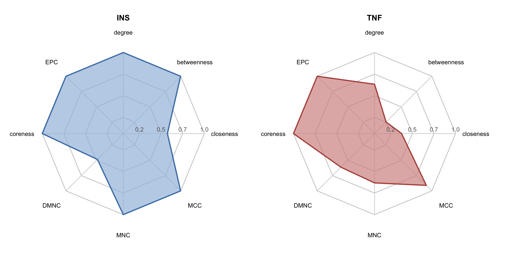
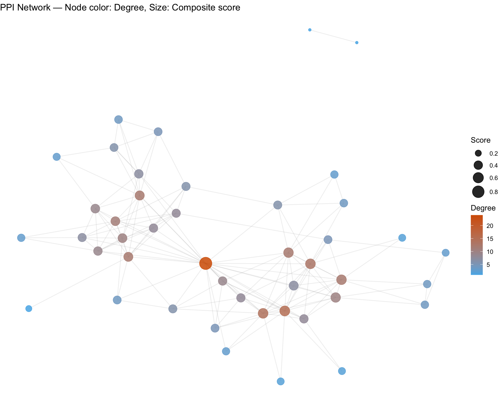
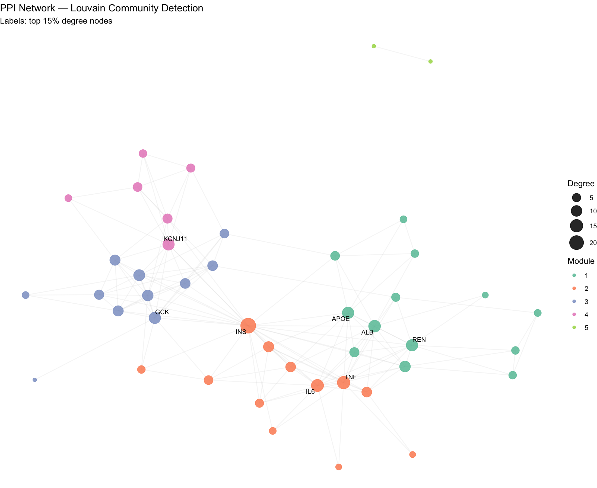
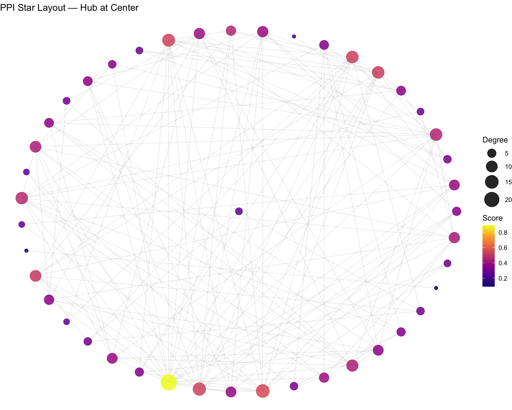
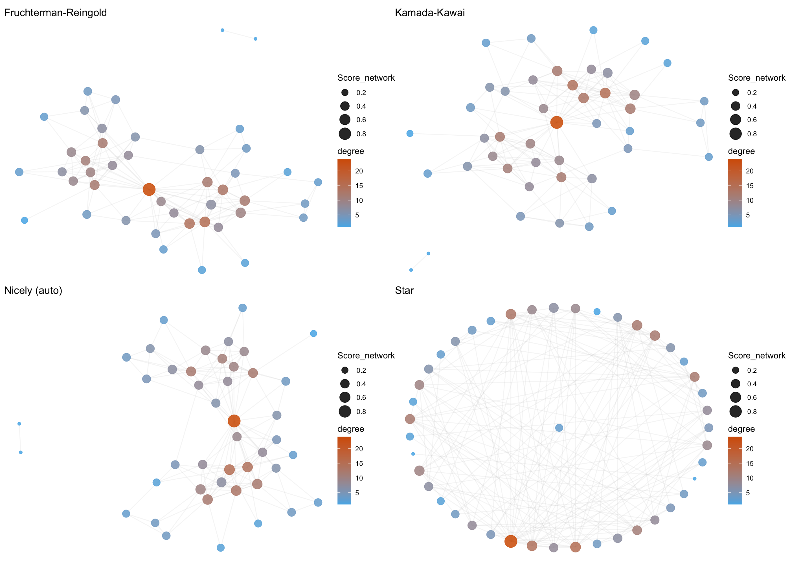

# PPI network analysis {#ppi-analysis}

Protein–protein interaction (PPI) networks are essential for deciphering the functional relationships among disease-related targets. `TCMDATA` provides a comprehensive PPI analysis pipeline that integrates data retrieval from STRING, network filtering, topological metric computation, community detection, and publication-ready visualization.

---

## Retrieving PPI data from STRING

`clusterProfiler::getPPI()` queries the STRING database and returns an `igraph` object containing known and predicted protein–protein interactions, with edge weights representing combined confidence scores (range 0–1).

```{r ppi-data, eval=TRUE, collapse=FALSE}
library(TCMDATA)
library(clusterProfiler)

# load demo data
data("dn_gcds")

# Retrieve human PPI network for top 50 DN-associated genes
ppi <- getPPI(dn_gcds[1:50], taxID = 9606)
ppi
```

The returned `igraph` object contains a `score` edge attribute representing STRING combined confidence scores, where higher values indicate stronger evidence for the interaction.

---

## Network filtering

Raw PPI networks often contain low-confidence edges that introduce noise. `ppi_subset()` provides a two-stage filter:

1. **Edge score cutoff** — removes edges below a confidence threshold.
2. **Top-*n* degree filter** — retains only the *n* most connected nodes.

```{r ppi-filter, eval=TRUE, collapse=FALSE}
# Filter: keep edges with score >= 0.7, then top 100 nodes by degree
ppi_filtered <- ppi_subset(ppi, score_cutoff = 0.7, n = 100)

cat("Before filtering:", vcount(ppi), "nodes,", ecount(ppi), "edges\n")
cat("After  filtering:", vcount(ppi_filtered), "nodes,", ecount(ppi_filtered), "edges\n")
```

| Parameter | Description | Default |
|-----------|-------------|---------|
| `score_cutoff` | Minimum edge confidence to retain | 0.7 |
| `n` | Top-*n* nodes by degree (NULL = all) | NULL |
| `rm_isolates` | Remove nodes with degree 0 after filtering | TRUE |

---

## Topological metrics {#topology}

Understanding which nodes serve as hubs, bottlenecks, or bridges is critical for prioritizing drug targets. `compute_nodeinfo()` calculates a comprehensive set of centrality measures — reproducing the full CytoHubba metric panel — in a single call.

```{r ppi-metrics, eval=TRUE, collapse=FALSE}
ppi_scored <- compute_nodeinfo(ppi_filtered, weight_attr = "score")
ppi_scored |> str()
```

The following metrics are computed and stored as vertex attributes:

| Category | Metric | Description |
|----------|--------|-------------|
| **Local** | `degree` | Number of direct neighbors |
| | `strength` | Sum of edge weights |
| | `clustering_coef` | Local clustering coefficient |
| | `coreness` | k-core decomposition level |
| **Global** | `betweenness` | Fraction of shortest paths passing through the node |
| | `closeness` | Inverse average shortest-path distance |
| | `eccentricity` | Maximum shortest-path distance to any other node |
| | `eigen_centrality` | Influence based on neighbor importance |
| | `pagerank` | Random-walk based ranking |
| **CytoHubba** | `MCC` | Maximum Clique Centrality |
| | `MNC` | Maximum Neighborhood Component |
| | `DMNC` | Density of MNC |
| | `BN` | BottleNeck score |
| | `EPC` | Edge Percolated Component |
| | `radiality` | Radiality centrality |
| | `Stress` | Number of shortest paths passing through a node |

### Integrated ranking

`rank_ppi_nodes()` normalizes all selected metrics to [0, 1], applies user-defined weights (equal by default), and produces a composite score for target prioritization:

```{r ppi-rank, eval=TRUE, collapse=FALSE}
rank_res <- rank_ppi_nodes(ppi_scored, use_weight = TRUE)

# Extract ranked table
ppi_ranked <- rank_res$graph
rank_df    <- rank_res$table

rank_df[1:10, c("name", "degree", "betweenness_w", "closeness_w",
                "MCC", "MNC", "EPC", "Score_network", "Rank_network")]
```

### Radar chart visualization

For a target of interest, `get_node_profile()` + `radar_plot()` produces a radar chart showing its normalized centrality fingerprint across multiple dimensions:

```{r ppi-radar, eval=FALSE, fig.width=10, fig.height=5, fig.align='center', out.width='95%', collapse=FALSE}
library(aplot)

# Pick the top 2 ranked nodes
top_nodes <- rank_df$name[1:2]

p_radar1 <- radar_plot(
  get_node_profile(rank_df, top_nodes[1]),
  fill_color = "#A3BEDD", line_color = "#4A7FB5",
  title = top_nodes[1]
)

p_radar2 <- radar_plot(
  get_node_profile(rank_df, top_nodes[2]),
  fill_color = "#D59390", line_color = "#B5524A",
  title = top_nodes[2]
)

plot_list(p_radar1, p_radar2, ncol = 2)
```

```{r, echo=FALSE, out.width='95%', fig.align='center'}

```

The radar chart provides an intuitive summary: a vertex with a large, well-rounded polygon is a strong hub across multiple centrality dimensions, whereas a highly elongated shape suggests dominance in only one metric.

---

## Community detection {#clustering}

Identifying densely connected subnetworks (modules) helps reveal functional protein complexes and signaling cascades. `TCMDATA` supports three complementary algorithms.

### Louvain modularity optimization

The Louvain algorithm maximizes modularity through iterative node reassignment. It is fast and well-suited for detecting large-scale functional modules.

```{r ppi-louvain, eval=TRUE, collapse=FALSE}
ppi_louvain <- run_louvain(ppi_scored, resolution = 1.0)
louvain_scores <- add_cluster_score(ppi_louvain, cluster_attr = "louvain_cluster", min_size = 3)

head(louvain_scores)
```

The `resolution` parameter controls granularity: values > 1 produce more, smaller clusters; values < 1 yield fewer, larger clusters.

### MCODE (Molecular Complex Detection)

MCODE is a classic algorithm specifically designed for PPI networks. It identifies dense regions by vertex weighting (k-core × density), seeded growth, and post-processing (haircut / fluff):

```{r ppi-mcode, eval=TRUE, collapse=FALSE}
ppi_mcode <- run_mcode(ppi_scored, vwp = 0.2, haircut = TRUE, fluff = FALSE)
mcode_res <- get_mcode_res(ppi_mcode, only_clusters = TRUE)

head(mcode_res)
```

| Parameter | Description | Default |
|-----------|-------------|---------|
| `vwp` | Vertex Weight Percentage — node score cutoff during growth | 0.2 |
| `haircut` | Remove singly-connected peripheral nodes | TRUE |
| `fluff` | Expand clusters with dense neighbors | FALSE |
| `k_core_threshold` | Minimum k-core level to retain a cluster | 2 |

### MCL (Markov Clustering)

MCL simulates stochastic flow on the graph via alternating expansion (matrix squaring) and inflation (element-wise power) steps. It is particularly effective for detecting well-separated clusters in biological networks.

```{r ppi-mcl, eval=TRUE, collapse=FALSE}
ppi_mcl <- run_MCL(ppi_scored, inflation = 2.5)
mcl_scores <- add_cluster_score(ppi_mcl, cluster_attr = "MCL_cluster", min_size = 3)

head(mcl_scores)
```

Higher `inflation` values (e.g., 3–5) yield tighter, more granular clusters; lower values (e.g., 1.5–2) produce larger modules.


## PPI network visualization {#ppi-vis}

`ggtangle` provides `ggplot2`-native network rendering with full aesthetic control over node color, size, labels, and edge styling.

### Basic PPI network

```{r ppi-net-basic, eval=FALSE, fig.width=10, fig.height=8, fig.align='center', out.width='95%', collapse=FALSE}
library(ggtangle)
library(ggplot2)

set.seed(2025)
p_ppi <- ggplot(ppi_ranked, layout = "fr") +
  geom_edge(alpha = 0.15, color = "grey60") +
  geom_point(aes(color = degree, size = Score_network), alpha = 0.85) +
  scale_color_gradient(low = "#56B4E9", high = "#D55E00", name = "Degree") +
  scale_size_continuous(range = c(1.5, 8), name = "Score") +
  theme_void() +
  labs(title = "PPI Network — Node color: Degree, Size: Composite score")

print(p_ppi)
```

```{r, echo=FALSE, out.width='95%', fig.align='center'}

```

### Network colored by community

Overlaying cluster assignments on the network layout reveals modular organization:

```{r ppi-net-louvain, eval=FALSE, fig.width=11, fig.height=9, fig.align='center', out.width='95%', collapse=FALSE}
library(ggrepel)
library(RColorBrewer)

set.seed(2025)
p_community <- ggplot(ppi_louvain, layout = "fr") +
  geom_edge(alpha = 0.12, color = "grey70") +
  geom_point(
    aes(color = louvain_cluster, size = degree),
    alpha = 0.85
  ) +
  scale_color_brewer(palette = "Set2", name = "Module") +
  scale_size_continuous(range = c(2, 9), name = "Degree") +
  geom_text_repel(
    aes(label = ifelse(degree >= quantile(degree, 0.85), name, "")),
    size = 3, max.overlaps = 20, segment.alpha = 0.3
  ) +
  theme_void() +
  labs(title = "PPI Network — Louvain Community Detection",
       subtitle = "Labels: top 15% degree nodes")

print(p_community)
```

```{r, echo=FALSE, out.width='95%', fig.align='center'}

```

### Hub-centric star layout

The star layout places the highest-degree node at the center, making hub–spoke relationships immediately visible:

```{r ppi-net-star, eval=FALSE, fig.width=10, fig.height=8, fig.align='center', out.width='95%', collapse=FALSE}
set.seed(2025)
p_star <- ggplot(ppi_ranked, layout = "star") +
  geom_edge(alpha = 0.15, color = "grey60") +
  geom_point(aes(color = Score_network, size = degree), alpha = 0.85) +
  scale_color_viridis_c(option = "C", name = "Score") +
  scale_size_continuous(range = c(2, 10), name = "Degree") +
  theme_void() +
  labs(title = "PPI Star Layout — Hub at Center")

print(p_star)
```

```{r, echo=FALSE, out.width='95%', fig.align='center'}

```

### Multi-layout comparison

```{r ppi-net-layouts, eval=FALSE, fig.width=14, fig.height=10, fig.align='center', out.width='100%', collapse=FALSE}
set.seed(2025)
base_layers <- list(
  geom_edge(alpha = 0.12, color = "grey70"),
  geom_point(aes(color = degree, size = Score_network), alpha = 0.85),
  scale_color_gradient(low = "#56B4E9", high = "#D55E00"),
  scale_size_continuous(range = c(1.5, 7)),
  theme_void()
)

p_fr     <- ggplot(ppi_ranked, layout = "fr")     + base_layers + ggtitle("Fruchterman-Reingold")
p_kk     <- ggplot(ppi_ranked, layout = "kk")     + base_layers + ggtitle("Kamada-Kawai")
p_nicely <- ggplot(ppi_ranked, layout = "nicely")  + base_layers + ggtitle("Nicely (auto)")
p_star2  <- ggplot(ppi_ranked, layout = "star")    + base_layers + ggtitle("Star")

plot_list(p_fr, p_kk, p_nicely, p_star2, ncol = 2)
```

```{r, echo=FALSE, out.width='100%', fig.align='center'}

```

| Layout | Best for |
|--------|----------|
| `"fr"` (Fruchterman-Reingold) | Dense networks; force-directed separation |
| `"kk"` (Kamada-Kawai) | Medium-sized networks with clear clusters |
| `"star"` | Hub-centric analysis |
| `"nicely"` | Automatic layout selection by igraph |

---

## Session information

```{r, collapse=FALSE}
sessionInfo()
```